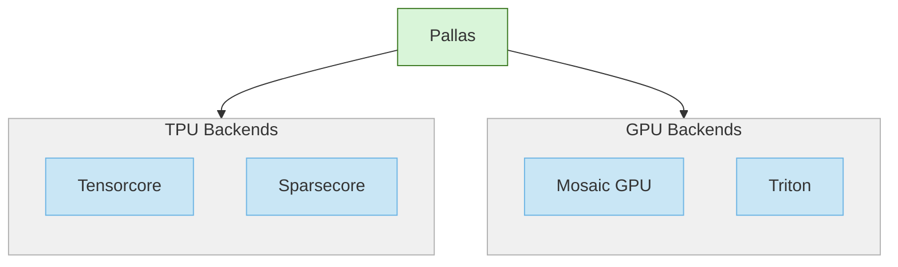

# Pallas: Custom Kernels in JAX

Welcome to the first blog post about custom kernels in JAX! Today we will cover Pallas, a JAX-native language for writing custom kernels that supports both TPUs and GPUs. Pallas gives users the ability to write high-performance, low-level code with the familiarity of JAX and Python.

<!-- more -->

<center></center>
<center><small>Meet Jit the kit -- the mascot of the Pallas project</small></center>

Pallas itself is an umbrella project that spans multiple backends, depending on which hardware you wish to target. Pallas maintains a small core codebase common across all backends, so that you can program with similar syntax and abstractions no matter which hardware you are using. However, Pallas also exposes low-level features specific to TPUs and GPUs, and thus does not aim to achieve 100% portability between TPUs and GPUs and also across hardware generations. On TPUs, Pallas supports programming both the TensorCore as well as the newer [SparseCore](https://docs.cloud.google.com/tpu/docs/system-architecture-tpu-vm#sparsecore). On GPUs, you have the choice of using the [Triton](https://triton-lang.org/)-based backend which more high-level, or [Mosaic GPU](https://docs.jax.dev/en/latest/pallas/gpu/index.html), which allows for lower-level control of the hardware.



In this blog post, we will cover hardware fundamentals, when to use custom kernels, and provide a short example of a TPU Pallas kernel. We plan on releasing more in-depth posts for each platform (TPUs and GPUs) in the future. If you are stuck with poor performance in your ML model and are curious about how you can unlock the potential of your expensive hardware, please read on!

## A Small Bit of History

Pallas was originally inspired by the release of OpenAI’s Triton project, a custom kernel DSL for GPUs, which allowed users to write highly performant kernels entirely in Python. As a fun fact, the name Pallas was meant to pay homage to Triton, as in Greek mythology, Pallas was the daughter of Triton (we later learned that the Triton project name was actually a reference to the nucleus of the hydrogen-3 isotope, but the Pallas name stuck!)
  
The [jax-triton](https://github.com/jax-ml/jax-triton) project was originally released to allow users to call Triton kernels from JAX. However, around the same time, JAX was exploring the concept of [Refs](https://docs.jax.dev/en/latest/array_refs.html) to allow users to express mutable arrays, lifting a long-standing restriction of immutability in JAX. This led to the development of a Ref-based API for kernel writing, and resulted in the initial version of Pallas using Triton as a backend. In order to better support TPUs and newer generations of GPUs, additional backends were developed (Mosaic TPU and Mosaic GPU), which led to Pallas in its current form today.

## How to Think About Kernels

Today, modern ML compilers such as XLA and Torch Inductor do a remarkable job at optimizing high-level tensor programs written in languages such as JAX or PyTorch. ML compilers have to make a multitude of decisions around memory space assignment, layouts, fusion, sharding, and more. For the majority of users, the out-of-the-box performance is “good enough”, but in some cases, a 5-10% performance increase could be a significant cost savings worth the additional engineering time, or some tricky idea could fool the compiler and lead it to generating suboptimal code (such as not performing a fusion you want, inserting a relayout or defensive copy, etc.). Custom kernel languages give you an “escape hatch” to program exactly what you want the hardware to do. Compilers generally lag behind state-of-the-art kernels as they need to implement a general solution to your specific problem.

How should you decide when to invest into custom kernels? Seeing low accelerator usage in a profiler for a particular operation could be a cause for concern, but it may not always be the full story as it may in fact be optimal for that particular computation. Instead, a good rule-of-thumb is to work from first principles (bandwidth, FLOP/s) and roofline analysis to estimate the theoretically optimal performance of the operation in question, and see if there is a large gap between the theoretical and realized performance. The [JAX scaling handbook](https://jax-ml.github.io/scaling-book/) is an excellent resource that goes through this analysis for Transformers in more detail.

For the following section, we will use the [specs](https://docs.cloud.google.com/tpu/docs/v5e) for TPU v5e:

| Chip Specification | Value |
| --- | --- |
| Peak bf16 FLOP/s |  197 TFLOP/s |
| HBM Bandwidth<sup>1</sup> | 819 GByte/s |
| ICI Bandwidth<sup>2</sup> | 1600 Gbit/s |

<small><sup>1</sup> HBM (high-bandwidth memory) bandwidth is the bandwidth for local communication between a chip's SRAM cache and its main memory.</small>

<small><sup>2</sup> ICI (inter-chip interconnect) bandwidth is the bandwidth for networked communication between connected devices within a TPU pod.</small>


### Processor Speed
The first number you typically see hardware specifications for accelerators is the peak FLOP/s (floating point operations per second). This number measures the maximum rate of arithmetic operations the processor can perform each second, assuming there are no other bottlenecks. For TPU v5e, this is 197 TFLOP/s for bf16 compute.

However, the stated FLOP/s does not tell the whole story as not all operations can be performed at the same speed. The vast majority (often 90%+) of the peak FLOP/s on modern accelerators is restricted to matrix multiplications performed by the TensorCore (GPUs) or MXU (TPUs). Element-wise operations such as point-wise addition or multiplication are performed at a much slower rate by the vector ALU on the chip. Scalar FLOP/s are also much lower, especially compared to CPUs. This means that if your workflow is not dominated by matrix multiplications, you should never expect to utilize more than 10-20% of the FLOP/s of your accelerator.


<center><small>A block diagram of TPU v4, showing 2 TensorCores, each with matrix multiplication (MXU), scalar, and vector computation units. Most of the FLOP/s capacity of this chip is contained in the MXUs.</small></center>

#### Example: Self-attention
Let’s consider computing self-attention - for simplicity, let’s assume that we are only using a single head, and no position embeddings or scaling. 

$$\textrm{Attention}(Q, K, V) = \textrm{Softmax}(QK^T)V$$

Where $Q$, $K$, and $V$ all have shape $[T, K]$ ($T$ denotes the sequence length, and $K$ denotes the head dimension). Self attention consists of two matrix multiplications – one of shape $[T, K] \times [K, T]$, and one of shape $[T, T] \times [T, K]$. There is also a softmax over the last axis of the logits ($QK^T$). Therefore total amount of floating point operations required for attention is:

-   $2T^2K$ for each matrix multiplication, for a total of $4T^2K$.
-   $3T^2$ for computing the softmax (exp, sum, and normalize).

For a rough estimate, we can divide the work $4T^2K + 3T^2$ by the FLOP/s of our chip to get a lower bound on the time to compute self-attention. However, note that this calculation does not distinguish between MXU/TensorCore and ALU operations, and in practice the softmax computation can bottleneck the matrix multiplications, lowering our achievable peak FLOP/s.

### Memory Hierarchy
Modern accelerators (such as TPUs and GPUs) typically contain multiple levels of memory just like CPUs, each trading off speed vs. capacity.

-  **Registers** live closest to the processor and can usually be accessed within a single processor cycle. Each core of an accelerator typically has a very limited number of registers (typically in the 10-100 range, depending on the type of register).
-  **Caches** (SRAM) typically live on same die as the processor, and can typically be accessed with 1-10x the latency of accessing a register. The amount of SRAM usually ranges in the 10s-100s MB range.
-  **HBM** (DRAM) lives on the same circuitboard as the processor and is connected to it via a high bandwidth interface. It usually takes on the order of 10x longer to access compared to SRAM. HBM ranges between 10-100GB for most modern accelerators. 
-  **Networking** is required when a model no longer fits on a single chip, and can be scaled up to thousands of accelerators for training the largest models.
    
Between each of the levels of the memory hierarchy, the memory bandwidth specifies the maximum rate of transfer between different levels of the hierarchy. Much like FLOP/s, this places a fundamental limit on the speed of a kernel - if we cannot load data fast enough to feed the processor then we become limited by the bandwidth instead, making the kernel memory-bound. This is generally seen as undesirable, since we typically want to be limited by the processor speed itself, which is known as compute-bound.

Of particular importance are the bandwidths at the networking and HBM levels as these are often slow enough that they force us to work around their limits. The specs for TPUv5e state a value of 819 GB/s of HBM bandwidth and 200 GB/s (1600 Gbit/s) of ICI bandwidth. HBM bandwidth should be used for calculations involving on-device compute (this is the bandwidth between HBM-SRAM), and ICI bandwidth should be used for cross-device communication such as collective operations (i.e. all-gather, all-reduce).

#### Example: All-gather

All-gather is a common collective operation done as part of [FSDP](https://jax-ml.github.io/scaling-book/training/#fully-sharded-data-parallelism-fsdp) or [Tensor/Megatron](https://jax-ml.github.io/scaling-book/training/#tensor-parallelism) sharding strategies, where one matrix is sharded along the contracting dimension of a matrix multiplication. In an all-gather, we assume that each device participating in the collective holds an equally sized slice, or shard, of the matrix, and the goal is to communicate these shards so that each device ends up with the entire unsharded matrix (the original matrix will be replicated across all devices).

The time to perform an all-gather is lower-bounded by the total size of the unsharded matrix $B$, divided by the ICI bandwidth for a single device. An easy way to see this is that each device needs to receive $B$ bytes of data in total from all other devices, so if the all-gather is performed as efficiently as possible with no wasted communication, it takes at least $B / \textrm{bandwidth}$ seconds to receive the entire unsharded matrix to a single device through its network link.

!!! note "Note on Software Pipelining"

    In our simple idealistic calculations, the total runtime of an operation is dictated by the time spent performing computation and time spent copying memory . The estimated runtime is whichever of the two is greater, but this assumes that they can be perfectly overlapped and performed in parallel.

    In practice, how do we achieve overlap between compute and memory? The answer is to pipeline compute with asynchronous memory transfers. That is, before starting our current block of compute, we prefetch the inputs for the next block and copy out the results from the previous block. Pallas provides APIs to help you easily construct pipelines, and you can read our guide on [software pipelining](https://docs.jax.dev/en/latest/pallas/pipelining.html) to learn more.

### Roofline Analysis

Given a fixed input shape to an operation, you can upper-bound how much time it will take by comparing the time spent on compute ($\frac{\textrm{work}}{  \textrm{flop/s}}$) and memory ($\frac{\textrm{bytes}}{\textrm{bandwidth}}$) and taking whichever is slower. We can take this one step further and analyze the tradeoff between compute/bandwidth as a function of parameters of your algorithm in a process known as roofline analysis. This can inform the design of your algorithm and model to ensure good usage of hardware resources.

Roofline analysis revolves around comparing the arithmetic intensity $I$ of your algorithm, or the ratio of FLOPs to bytes transferred, to the ratio of FLOP/s-bandwidth of your hardware. If the arithmetic intensity is greater, then roofline analysis predicts that your algorithm will be compute-bound (or memory bound if intensity is less).

<center></center>

#### Example: Local Matrix Multiplication

For a TPU v5e, the theoretical arithmetic intensity we need to achieve for a kernel to become compute-bound is 197 TFLOP/s divided by the HBM bandwidth 819 GB/s ≈ 240 FLOPs/byte. Let’s see what roofline analysis says about a basic operation such as matrix multiplication. For many matrix multiplications, SRAM is too small to fit the entire input/output matrices, so we write our kernel to perform the matrix multiplication [blockwise](https://en.wikipedia.org/wiki/Block_matrix#Multiplication). A key design question is to decide what block size to use. A bf16 matrix multiplication (involving the shapes $[N, N] \times [N, N]$) requires a total of $2N^3$ bf16 flops to compute, and requires a transfer of $6N^2$ bytes (3 $[N, N]$ matrices, with each bf16 element requiring 2 bytes to store). Therefore, the arithmetic intensity of the algorithm in terms of N is $N/3$. As long as we use a block size of $N > 720$, this matrix multiplication will be compute-bound on TPU v5e, which is when the compute time $2N^3$ is greater than the memory time $6N^2$.

Roofline analysis is a good rule of thumb, but where can roofline analysis go wrong?

-   The first place where roofline analysis can be misleading is when directly applied to GPUs, due to interactions with the L2 cache. GPU kernels typically use small block sizes (such as $N=128$) due to the limited amount of SMEM per core, and at this size, roofline estimates will almost surely be memory-bound. But because not all memory accesses go to HBM, your kernel can still be in the compute-bound regime if you have a good L2 cache hit rate. Therefore, on GPUs it can be a bit difficult to directly compute an accurate roofline analysis, but the principles still hold.
    
-   Roofline analysis also assumes that the peak FLOP/s and bandwidth are achievable for the duration of the kernel. The realized FLOP/s can be much lower than the stated peak for algorithmic reasons such as not utilizing the TensorCore/MXUs to their full capacity, pipelining bubbles, or for physical reasons such as power throttling. Similarly, bandwidth can be limited if you are instead in a latency-bound regime, or other hardware conditions are not met to maximize throughput.

## Hello World - TPU matrix multiplication

Now that we have some conceptual understanding of when to use custom kernels, what does a Pallas kernel actually look like? We’ll proceed with an example of a TPU matrix multiplication kernel, since it demonstrates all of the important basics in a small amount of code.

```python
import numpy as np
import jax
from jax import numpy as jnp
from jax.experimental import pallas as pl
from jax.experimental.pallas import tpu as pltpu

M, N, K = 4096, 4096, 4096
x = jax.random.normal(jax.random.key(0), (M, K), jnp.bfloat16)
y = jax.random.normal(jax.random.key(1), (K, N), jnp.bfloat16)
reference = jnp.dot(x, y, preferred_element_type=jnp.float32)

@pl.kernel(
  out_shape=jax.ShapeDtypeStruct((M, N), jnp.float32),
  mesh=pltpu.create_tensorcore_mesh("x")
)
def matmul_kernel(x_hbm_ref, y_hbm_ref, out_hbm_ref):
  def pipeline_body(x_vmem_ref, y_vmem_ref, out_vmem_ref):  #(1)!
    @pl.when(pl.program_id(2) == 0)  #(2)!
    def _():
      out_vmem_ref[...] = jnp.zeros_like(out_vmem_ref)
    out_vmem_ref[...] += jnp.dot(x_vmem_ref[...], y_vmem_ref[...],
      preferred_element_type=jnp.float32)
  pltpu.emit_pipeline(pipeline_body,
    in_specs=[pl.BlockSpec((512, 512), lambda i, j, k: (i, k)),
              pl.BlockSpec((512, 512), lambda i, j, k: (k, j))],
    out_specs=pl.BlockSpec((512, 512), lambda i, j, k: (i, j)),
    grid=(M // 512, N // 512, K // 512)
  )(x_hbm_ref, y_hbm_ref, out_hbm_ref)

kernel_result = matmul_kernel(x, y)
np.testing.assert_allclose(kernel_result, reference, atol=1e-4)
```

1.  On TPUs, SRAM is known as VMEM (vector memory) or SMEM (scalar memory).
    Note that SMEM on TPUs means something different from GPU SMEM (where it stands for shared memory).
2.  Here, we need to explicitly zero-out `out_vmem_ref` on the first accumulation step
    of each output block as Pallas does not guarantee any initialization for buffers.

We construct a Pallas kernel using the `pl.kernel` entry point. Passing in `mesh=pltpu.create_tensorcore_mesh("x")` informs JAX that we wish to use the TPU tensorcore backend (as opposed to GPU or TPU sparsecore). On TPUs with megacore enabled, the axis name we passed in can be queried to obtain the core id via `lax.axis_index("x")`.

Note the function signature of matmul_kernel. The inputs to `matmul_kernel` (`x` and `y`) become [Refs](https://docs.jax.dev/en/latest/array_refs.html) when inside of the kernel body, which represent mutable buffers in JAX. Refs in Pallas are used to represent locations in memory, such as HBM or SRAM, whereas arrays always represent values held in registers. Refs can be loaded (`x = ref[idx]`), sliced (`ref.at[idx]`), or set (`ref[idx] = x`), but compute typically cannot be performed on them unless loaded into registers. Note that the slicing syntax currently only works in Pallas and not in standard JAX.

On TPUs, we can’t directly load values from HBM into registers, so we need to load them into VMEM/SRAM first. Our input matrices are of shape $N=4096$ which is too large to fit in VMEM, so we will load them into smaller blocks of $N=512$ instead. To help with this, we use a software pipeline, invoked via `pltpu.emit_pipeline`, to overlap (a) copying blocks from HBM to SRAM, (b) computing the matrix multiplication on the SRAM block, and (c) copying the outputs from SRAM back to HBM. You can see the reference on [grids and BlockSpecs](https://docs.jax.dev/en/latest/pallas/grid_blockspec.html) to see how the pipeline should be defined.

The actual compute work is defined in `pipeline_body`, where we load the values from VMEM into registers, and use `jnp.dot` to perform the matrix multiplication. With appropriate tuning of block sizes informed by roofline analysis, even a kernel this simple can reach 90%+ TPU utilization! Take a look at the [TPU matrix multiplication](https://docs.jax.dev/en/latest/pallas/tpu/matmul.html) guide for more details.

## Where to start with Pallas

Documentation and tutorials for Pallas is split across each backend and can be found through the following links:

-   [TPU documentation](https://docs.jax.dev/en/latest/pallas/tpu/index.html)
-   [TPU instruction reference](https://docs.jax.dev/en/latest/jax.experimental.pallas.tpu.html) 
-   [MGPU documentation](https://docs.jax.dev/en/latest/pallas/gpu/index.html)
-   [MGPU instruction reference](https://docs.jax.dev/en/latest/jax.experimental.pallas.mosaic_gpu.html)
    
Note that the Triton backend is in maintenance mode as of the publishing of this blog post and will not receive major feature updates moving forwards.

For code examples, the JAX repository maintains [a collection of example kernels](https://github.com/jax-ml/jax/tree/main/jax/experimental/pallas/ops) across all backends. The [Tokamax](https://github.com/openxla/tokamax) library also contains a collection of production-ready kernels written in Pallas.

We will also be publishing blog posts covering introductions and tutorials for individual backends in the future, so stay tuned!

